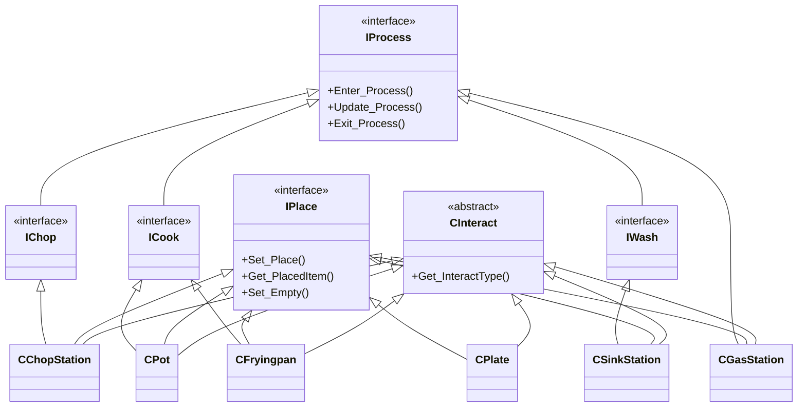
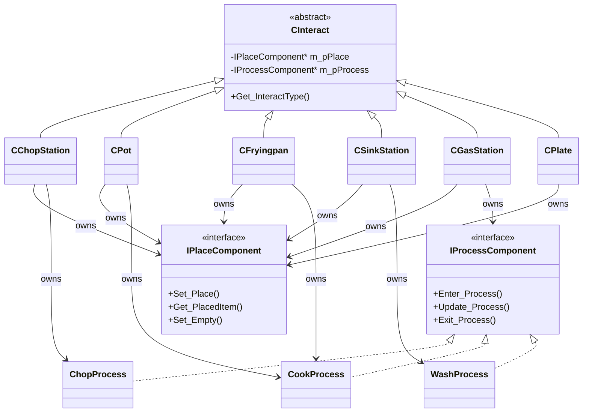

---

title: "[유지보수 회고] 재료 · 조리대 클래스 구조 분석"

date: 2026-08-25

tags:

  - devlog

  - SR_Overcooked2

  - refactoring

draft: true

---

  

SR_Overcooked2를 유지보수 관점에서 다시 들여다보면서, 재료(`CIngredient`)와 조리대(`CInteract` 계열) 두 축의 클래스 구조를 회고한다. 결론부터 말하면 두 축 모두 "확장할수록 캐스팅과 분기가 늘어나는" 같은 종류의 문제를 갖고 있다.

  

### 재료 분석

  

#### 문제 1 — `CIngredient`가 재료 데이터와 FSM 컨텍스트를 겸함

  

```cpp

// Client/Header/CIngredient.h

class CIngredient : public CInteract

{

    ...

protected:

    INGREDIENT_TYPE   m_eIngredientType;  ///< 재료 종류 (재료 데이터)

    COOKSTATE         m_eCookState;       ///< 조리 상태 값 (재료 데이터)

    IState*           m_pCurrentState;    ///< 현재 State* — FSM 컨텍스트

    _bool             m_bLocked;          ///< 조리 중 잠금 여부

    ...

};

```

  

**무엇이 문제인가**: "재료가 무엇인가(종류)"와 "재료가 지금 어떤 상태 처리 로직을 타야 하는가(FSM)"가 한 클래스에 뒤섞여 있다. `CTomato`, `CFish` 같은 재료 서브클래스 20여 개가 전부 이 조합을 그대로 상속받기 때문에, FSM 쪽만 바꾸고 싶어도 `CIngredient` 전체를 건드리게 된다.

  

**지금이라면**: FSM 컨텍스트(`m_pCurrentState` 및 전이 로직)를 `CIngredientStateMachine` 같은 컴포넌트로 분리하고, `CIngredient`는 그 컴포넌트를 멤버로 소유하게 만든다. 재료 데이터와 상태 전이 책임이 분리되어 각각 독립적으로 테스트·확장할 수 있다.

  

---

  

#### 문제 2 — State 전환마다 `new`/`delete`

  

```cpp

// Client/Code/CIngredient.cpp

void CIngredient::ChangeState(IState* pNextState)

{

    if (m_pCurrentState)

    {

        m_pCurrentState->Exit_State(this);

        delete m_pCurrentState;

    }

  

    m_pCurrentState = pNextState;

    if (m_pCurrentState)

        m_pCurrentState->Enter_State(this);

}

```

  

호출부도 매번 새 인스턴스를 만들어 넘긴다:

  

```cpp

// Client/Code/IState.cpp (IChopState::Update_State 내부)

pIngredient->ChangeState(new IDoneState());

```

  

**무엇이 문제인가**: `IRawState`/`IChopState`/`ICookState`/`IDoneState`/`IBurntState`는 재료마다 다른 데이터를 갖지 않는 순수 로직 객체인데도, 상태가 바뀔 때마다 `new`로 새로 만들고 이전 것은 `delete`한다. 씬에 재료가 많고 상태 전이가 잦은 게임 특성상(썰기 완료, 조리 완료, 태움 등) 프레임마다 힙 할당/해제가 반복될 소지가 있다.

  

**지금이라면**: 각 State는 상태를 갖지 않으므로 싱글턴이나 static 인스턴스로 재사용(오브젝트 풀링 또는 그냥 static 변수)하면 된다. `ChangeState`는 `delete` 없이 포인터만 교체하도록 바뀐다.

  

---

  

#### 문제 3 — State 내부에서 재료 종류별 분기 (OCP 위반)

  

```cpp

// Client/Code/IState.cpp

void IChopState::Enter_State(CIngredient* pIngredient)

{

    pIngredient->Set_State(CIngredient::CHOPPED);

  

    CIngredient::INGREDIENT_TYPE eType = pIngredient->Get_IngredientType();

  

    if (CIngredient::LETTUCE == eType ||

        CIngredient::TOMATO == eType ||

        CIngredient::CUCUMBER == eType ||

        CIngredient::FISH == eType ||

        CIngredient::SHRIMP == eType ||

        CIngredient::TOMATOSOUP == eType)

        pIngredient->Set_IconVisible(true);

}

  

void IChopState::Update_State(CIngredient* pIngredient, const _float& fTiemDelta)

{

    CIngredient::INGREDIENT_TYPE eType = pIngredient->Get_IngredientType();

  

    if (CIngredient::TOMATO == eType && dynamic_cast<CTomatoSoup*>(pIngredient))

        return;

  

    if (CIngredient::TOMATO == eType || CIngredient::LETTUCE == eType || CIngredient::CUCUMBER == eType ||

        CIngredient::FISH == eType || CIngredient::SHRIMP == eType)

        pIngredient->ChangeState(new IDoneState());

}

```

  

**무엇이 문제인가**: "썬 상태에서 바로 완료 상태로 넘어갈 재료 목록"이 `IChopState` 안에 하드코딩되어 있다. 재료를 하나 추가할 때마다(예: 새 채소) 이 if 체인을 찾아서 수정해야 하고, 심지어 `CTomatoSoup`처럼 구체 서브클래스를 `dynamic_cast`로 예외 처리하는 코드까지 State 안에 끼어 있다. State가 "재료 종류 목록"을 알아야 하는 구조라 OCP를 위반한다.

  

**지금이라면**: "썰기 후 바로 완료되는가"는 재료 자체의 속성(가상 함수 `Skips_Cook()` 또는 재료 메타데이터 테이블)으로 옮기고, State는 그 질의만 던지도록 한다. 그러면 재료 추가는 재료 클래스 쪽 값만 채우면 끝나고, State 코드는 건드릴 필요가 없다.

  

---

  

#### 발견한 추가 문제 — enum과 State 포인터, 두 개의 진실 공급원

  

분석 방향에는 없었지만, 실제 조리대 코드를 보면 `IState` 다형성 자체가 거의 쓰이지 않고 대신 `COOKSTATE` enum을 직접 비교하는 코드가 훨씬 많다. 심지어 상태 세터 두 개(`Set_State` enum 값 직접 대입 vs `ChangeState` State 객체 교체)가 서로 동기화 없이 섞여 쓰인다.

  

```cpp

// Client/Code/CFryingpan.cpp

_bool CFryingpan::Enter_Process()

{

    CIngredient* pIngredient = dynamic_cast<CIngredient*>(Get_Item());

    if (nullptr == pIngredient || CIngredient::BURNT == pIngredient->Get_State())

        return false;

  

    Set_Process(true);

    pIngredient->Set_State(CIngredient::COOKED);   // enum만 직접 변경, m_pCurrentState는 그대로 IChopState

    ...

}

  

void CFryingpan::Exit_Process()

{

    ...

    if (Get_Progress() >= 2.f)

    {

        pIngredient->ChangeState(new IBurntState());  // 여기선 State 객체를 교체

        ...

    }

}

```

  

**무엇이 문제인가**: `Enter_Process`는 `Set_State(COOKED)`로 enum만 바꾸고 `m_pCurrentState`(IState*)는 갱신하지 않는다. 그 결과 `m_eCookState == COOKED`인데 `m_pCurrentState`는 여전히 `IChopState`를 가리키는 순간이 존재한다. `IChopState::Update_State`가 그 프레임에 실행되면 재료 종류에 따라 엉뚱하게 `IDoneState`로 넘어갈 수도 있다. FSM을 상태 enum과 State 객체 이중 구조로 유지하면서 갱신 시점이 어긋난 셈이라, 애초에 분석에서 언급한 "외부에서 dynamic_cast로 State 확인" 패턴보다 이 이중 상태 불일치가 더 실질적인 위험으로 보인다. (아래 "분석과 다른 점" 참고)

  

---

  

### 조리대 분석

  

#### 문제 1 — `IPlace`/`IProcess` 다중 상속으로 "능력"을 is-a로 표현

  

```cpp

// Client/Header/CChopStation.h

class CChopStation : public CInteract, public IPlace, public IChop { ... };

  

// Client/Header/CPot.h

class CPot : public CInteract, public IPlace, public ICook { ... };

  

// Client/Header/CFryingpan.h

class CFryingpan : public CInteract, public IPlace, public ICook { ... };

  

// Client/Header/CSinkStation.h

class CSinkStation : public CInteract, public IPlace, public IWash { ... };

  

// Client/Header/CGasStation.h

class CGasStation : public CInteract, public IPlace, public IProcess { ... };

  

// Client/Header/CPlate.h

class CPlate : public CInteract, public IPlace { ... };

```

  

**무엇이 문제인가**: "이 조리대는 물건을 올릴 수 있다(`IPlace`)", "이 조리대는 가공 작업을 한다(`IChop`/`ICook`/`IWash`)"는 능력을 전부 다중 상속으로 표현한다. 조리대 종류가 늘어날수록 `CInteract + IPlace + I???`의 조합이 계속 늘어나는 믹스인 조합 폭발 구조다. `IChop`/`ICook`/`IWash`/`IExtinguish`가 사실상 `IProcess`를 그대로 복붙한 빈 서브인터페이스라는 점도 이 구조의 증상이다.

  

```cpp

// Client/Header/IProcess.h

class IChop : public IProcess {

public:

    virtual _bool Enter_Process() = 0;

    virtual void Update_Process(const _float& fTimeDelta) = 0;

    virtual void Exit_Process() = 0;

};

// ICook, IWash, IExtinguish도 동일한 순수가상 3종 세트를 그대로 반복 선언

```

  

**지금이라면**: `IPlaceComponent`, `IProcessComponent`(Chop/Cook/Wash/Extinguish는 이 컴포넌트의 전략 구현체)를 조리대가 멤버로 소유하는 컴포지션 구조로 바꾼다. 새 조리대는 필요한 컴포넌트만 조립하면 되고, 빈 서브인터페이스 4종은 사라진다.

  

---

  

#### 문제 2 — 능력 확인을 `dynamic_cast` 체이닝으로 처리

  

```cpp

// Client/Code/CRealPlayer.cpp — 상호작용 키 처리

void CRealPlayer::ActKey_Algorithm()

{

    ...

    if (dynamic_cast<IChop*>(m_pCursorStation)) {

        m_pIChop = dynamic_cast<IChop*>(m_pCursorStation);

        if (m_pIChop->Enter_Process()) { ... }

    }

    else if (dynamic_cast<IWash*>(m_pCursorStation)) {

        m_pIWash = dynamic_cast<IWash*>(m_pCursorStation);

        if (m_pIWash->Enter_Process()) { ... }

    }

}

```

  

`IPlace.h` 내부에서도 자기 자신을 캐스팅해 능력을 확인한다:

  

```cpp

// Client/Header/IPlace.h

virtual void Set_Empty()

{

    m_bFull = false;

    m_pPlacedItem = nullptr;

  

    if (dynamic_cast<IProcess*>(this))

        dynamic_cast<IProcess*>(this)->Set_Progress(0.f);

}

```

  

**무엇이 문제인가**: 플레이어 입력 처리 쪽이 "지금 바라보는 조리대가 Chop인가 Wash인가"를 직접 `dynamic_cast`로 물어보고 분기한다. `ICook`이나 `IExtinguish` 조리대를 이 키 처리 경로에 추가하려면 `CRealPlayer.cpp`(그리고 동일 패턴을 쓰는 `CFakePlayer.cpp`)의 if/else-if 체인에 새 분기를 또 추가해야 한다. 다형성을 쓰는 이유(공통 인터페이스로 호출)가 무색해지고, 새 능력이 늘어날 때마다 호출부 여러 곳을 동시에 고쳐야 하는 산탄총 수술(shotgun surgery)이 발생한다.

  

**지금이라면**: `CInteract`(혹은 `IPlaceComponent`)가 `Get_ProcessComponent()`처럼 있으면 반환하고 없으면 `nullptr`을 반환하는 단일 접근자를 제공해, 호출부는 캐스팅 체인 없이 한 번만 조회하면 되도록 만든다. 능력이 늘어나도 `CRealPlayer`의 분기 개수는 늘지 않는다.

  

---

  

### 다이어그램

  

#### Before — 다중 상속 구조

  



  

#### After — 컴포지션 구조

  



  

---

  

### 분석과 다른 점 / 추가로 발견한 문제

  

기존 분석의 결론은 바꾸지 않았고, 그 결론을 뒷받침하는 근거를 찾는 과정에서 아래 두 가지는 실제 코드가 예상과 조금 다르거나 더 심한 형태로 나타났다는 점만 별도로 알려드린다.

  

1. **"재료 State에 대한 외부 `dynamic_cast`"는 코드베이스에서 찾지 못했다.** `dynamic_cast<IChopState*>` 같은 패턴은 존재하지 않는다. 대신 조리대들(`CFryingpan`, `CPot`, `CPlate`, `CSinkStation`, `CTrashStation`, `CCleanPlateStation` 등)이 `pIngredient->Get_State() == CIngredient::BURNT/DONE/CHOPPED/RAW` 형태로 **`COOKSTATE` enum을 직접 비교**한다. 즉 `IState` 다형성은 만들어져 있지만 정작 조리대 쪽 로직은 그 다형성을 거의 쓰지 않고 enum 분기로 우회하고 있다 — "다형성 이점 상실"이라는 결론 자체는 같지만, 원인이 dynamic_cast가 아니라 **애초에 State 다형성을 호출하는 대신 enum을 들여다보는 관성적인 코드 스타일**이라는 점이 다르다.

2. **enum(`m_eCookState`)과 State 포인터(`m_pCurrentState`)가 별도로 갱신되어 서로 어긋날 수 있다.** 위 "발견한 추가 문제"에서 다룬 `CFryingpan::Enter_Process`의 `Set_State(COOKED)` 직접 대입이 대표 사례다. 이는 문제 1(책임 뭉침)과 문제 4(다형성 상실)가 겹쳐서 만든 부작용으로 보이며, 컴포넌트 분리 시 "state enum과 FSM 객체의 단일 진실 공급원 통일"을 설계 목표에 명시적으로 추가하는 게 좋겠다.

3. **재료 서브클래스마다 상태별 렌더링 분기가 그대로 복붙되어 있다.** `int iIndex = (RAW != m_eCookState) ? 1 : 0;` 한 줄이 `CTomato.cpp`, `CCucumber.cpp`, `CFish.cpp`, `CLettuce.cpp`, `CShrimp.cpp` 5개 파일의 **동일한 77번째 줄**에 토씨 하나 안 틀리고 반복돼 있다. `Render_GameObject`가 `m_eCookState`(재료 상태)를 직접 들여다보고 텍스처 인덱스를 고르는 구조라, "익었으면 텍스처 1번" 같은 규칙이 바뀌면 5곳을 동시에 고쳐야 한다. State 컴포넌트로 분리할 때 이 렌더링 분기도 같이 정리 대상에 넣을 만하다.